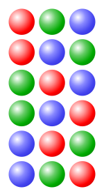

# Sum

Из 2 непересекающихся множеств 1 элемент может быть выбран M + N способами
#### Пример:
Номер машины состоит из букв (26) и цифр (10)
36 различных выборов для одного символа

# Multiplication

Количество способов, которыми можно выбрать упорядоченную пару равно произведению количества вариантов выбора первого элемента на количество выборов второго элемента.

#### Пример:
Из 28 сортов мороженого и 4 сортов сиропа можно создать 28*4 = 112 мороженых с сиропом

# Строки

Строка - последовательность элементов S. 
Иногда, используется термин k-подстрока - строка длиной k.

Если алфавит содержит n элементов, то количество разных строк равно
n * n * n (k раз) = nk

Потому что есть n вариантов выбор каждого злемента.

#### Пример:
Количество двоичных чисел с длиной 3

23 = 8.

000, 001, 011, 100, 101, 010, 110, 111

# Permutation (Перестановка)

Упорядоченная последовательность всех элементов из S, в которой элементы не встречаются больше 1 раза.

Пусть в S n элементов.

Количество разных расположений:
n! = n * (n-1) * (n-2)

#### Пример:
Количество перестановок 3 шариков (красный, зеленый, синий)

# Permutation with repetition (Перестановка c повторениями)

In general, repetitions are taken care of by dividing the permutation by the factorial of the number of objects that are identical.

Пусть имеется n объектов различных типов:
n1 первого типа
n2 второго типа
......
n(k) k-го  типа

Сколькими способами можно переставить все объекты между собой?

Для все объектов n! и так как объекты одного типа взаизаменяемы и могут быть переставлены
n(k)! раз внутри, то надо разделить на все перестановки типов

n!/(n1!n2!...n(k)!)

# k-Permutation (Размещение)

Упорядоченная последовательность k элеметов,  в которой элементы не встречаются больше 1 раза.

n * (n - 1) * (n - k + 1) = n!/(n-k)!

# k-Combinations (Сочетания)

k элеметов из n, без упорядочивания (и без повторений).

Вывод формулы: берем количество размещений и убираем упорядочивание.
В k размерном множестве может быть k! различных выборов элементов из множества k.

Делим количества сочетаний на количество повторений.

n!/k!(n-k)!

Формула симметрична относительно k и (n - k)

(n, k) = (n, k -1)

#### Пример:

Количество возможных флопов в покере (первые 3 карты на столе).

